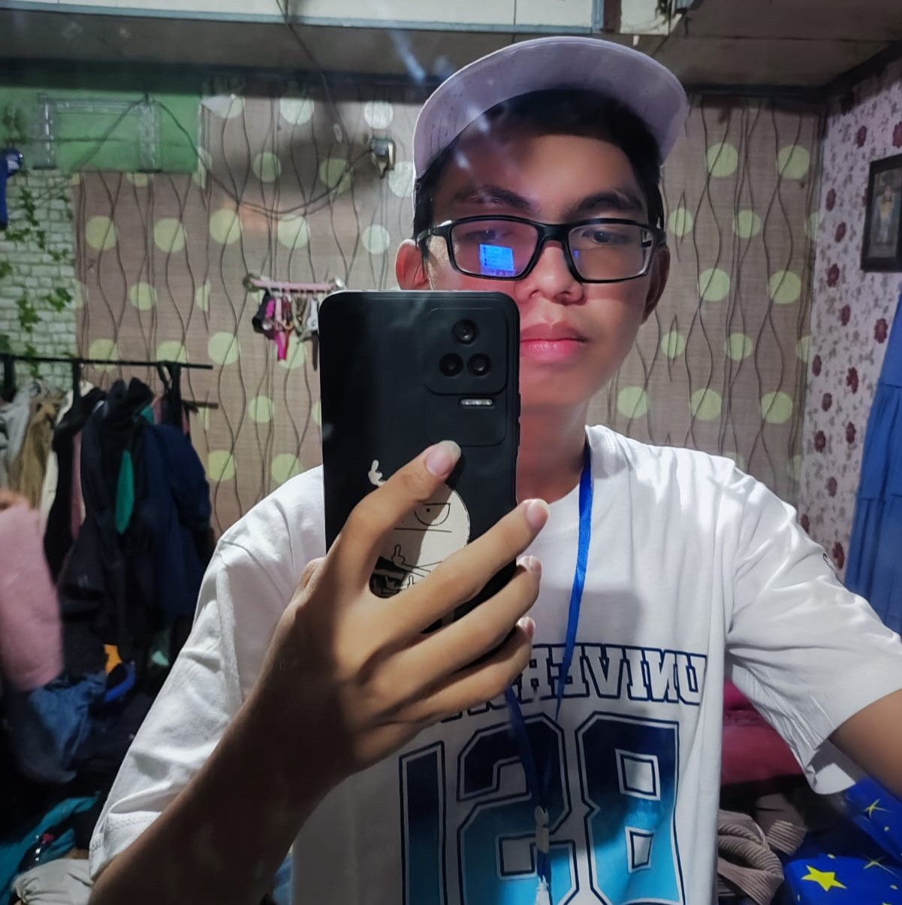
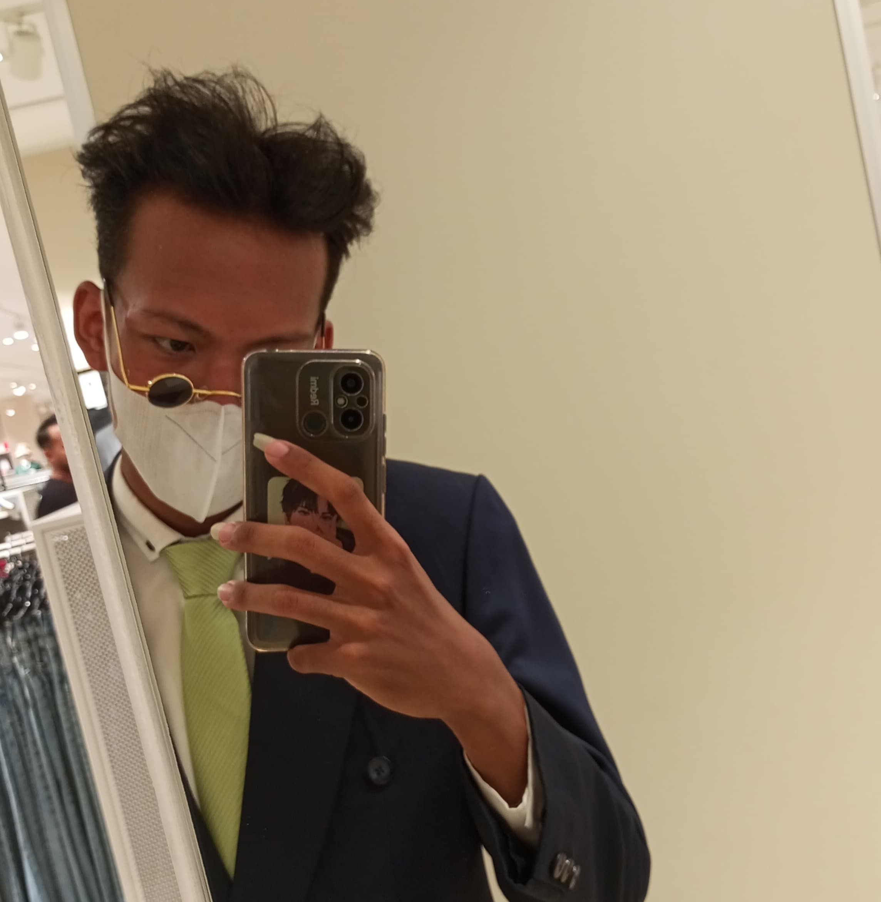

<!-- PROJECT LOGO -->
<br />
<div align="center">
  <a href="https://github.com/othneildrew/Best-README-Template">
    
  </a>

  <h3 align="center">TREASURE MERCH WEBSITE</h3>

  <p align="center">
    <b>Create Memories:</b> Discover Exclusive Merch That Will Keep You Captive.
    <br />
    <br />
    <a href="https://tm-official.netlify.app">View Demo</a>
    <!-- <a href="https://github.com/othneildrew/Best-README-Template/issues">Report Bug</a>
    ·
    <a href="https://github.com/othneildrew/Best-README-Template/issues">Request Feature</a> -->
  </p>
</div>

<!-- ABOUT THE PROJECT -->

## About The Project


There are many great README templates available on GitHub; however, I didn't find one that really suited my needs so I created this enhanced one. I want to create a README template so amazing that it'll be the last one you ever need -- I think this is it.

Here's why:

- Your time should be focused on creating something amazing. A project that solves a problem and helps others
- You shouldn't be doing the same tasks over and over like creating a README from scratch
- You should implement DRY principles to the rest of your life :smile:

Of course, no one template will serve all projects since your needs may be different. So I'll be adding more in the near future. You may also suggest changes by forking this repo and creating a pull request or opening an issue. Thanks to all the people have contributed to expanding this template!

<!-- GETTING STARTED -->

## Getting Started

This is an example of how you may give instructions on setting up your project locally.
To get a local copy up and running follow these simple example steps.

### Installation

_Below is an example of how you can instruct your audience on installing and setting up your app. This template doesn't rely on any external dependencies or services._

- Clone the repo
  ```sh
  git clone https://github.com/zidan-herlangga/treasure-merch.git
  ```

<!-- CONTRIBUTING -->

## Contributing

Contributions are what make the open source community such an amazing place to learn, inspire, and create. Any contributions you make are **greatly appreciated**.

If you have a suggestion that would make this better, please fork the repo and create a pull request. You can also simply open an issue with the tag "enhancement".
Don't forget to give the project a star! Thanks again!

<!-- LICENSE -->
<!--
## License

Distributed under the MIT License. See `LICENSE.txt` for more information. -->

Thank you to our teams 🙏

<a href="#!" target="_blank"></a>
<a href="#!" target="_blank"></a>
<a href="#!" target="_blank"></a>
<a href="#!" target="_blank"></a>
<a href="#!" target="_blank"></a>

<!-- CONTACT -->

## Contact

Zidan Herlangga - [@Twitter](https://twitter.com/dansec04_)

Github: [https://github.com/zidan-herlangga](https://github.com/zidan-herlangga)
